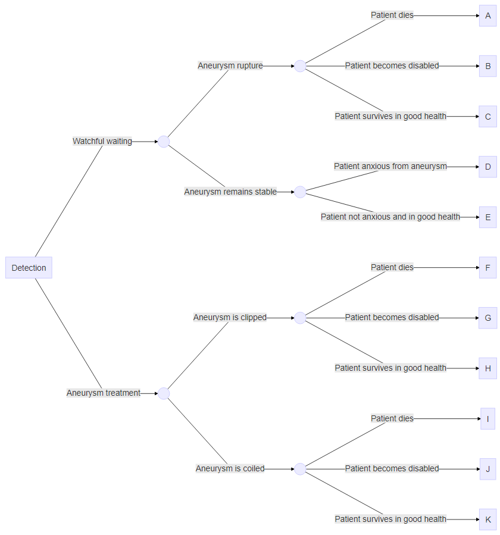

```{r setup, include=FALSE}
knitr::opts_chunk$set(echo = TRUE)
```
```{r, echo = TRUE}
rm(list  = ls()) # clear environment
options(scipen = 999) # Disable scientific notations
library(tidyverse)
library(knitr)
```

# Aim
The aim of this practical assignment is to perform a health economic analysis using a decision tree. You are asked to evaluating the cost-effectiveness of a management strategy for patients with unruptured intracranial aneurysms versus watchful waiting.

# Instuctions
  
1. Download the folder `Practical_Decision_tree` from the Canvas page and save it on your computer
2. Before performing the assignment, have a look at how the decision tree looks like on the next pages  
2. Open the `Assignment_start_DT.R` file and follow the steps in the R file      
3. Once you have completed the assignment, answer the questions at the end of this document    

\newpage
# Decision tree
This section provides an explanation of the decision tree used in this practical assignment. The decision tree compares two strategies: "Aneurysm treatment" and "Watchful waiting". The "Detection" rectangle represents the decision node (i.e. the point where the different strategies are defined). Both main branches of the decision tree describe the possible trajectories for each of these strategies. The circles are the chance nodes. Figure 1 provides a textual description of the trajectories, and Figure 2 provides a description of which probabilities belongs to each branch of the decision tree.  
NOTE: the sum of the probabilities following a chance node must sum up to 1.  
```{r, fig.align = 'center', fig.cap = "Description decision tree", echo = F}

```

```{r, fig.align = 'center', fig.cap = "Probabilities decision tree", echo = F}
knitr::include_graphics("DT_graph_probs.png")
```

\newpage
# Questions  
0. Follow the steps in the `Assignment_start_DT.R` file and follow the steps.
1. Look at your final results.  
1.a. What is your conclusion?  
1.b. Which strategy has the most favorable cost-effectiveness if we are willing to pay €20,000 for a gain in utility of 1 (or 1 additional QALY if we assume a one-year time horizon for this decision tree)?  
1.c. How does the utility of patients with an untreated aneurysm (uAnxious) affect the cost-effectiveness results? What happens if you disregard any potential anxiety and set uAnxious equal to uHealthy?  
1.d. In the past, aneurysm coiling, which is an endovascular procedure was not yet available in all hospitals. What would you advise to a hospital which only offers aneurysm clipping, should they go with the Watchfull Waiting strategy or with the Aneurysm Treatment (100% clipping) strategy?  
1.e. And what would you advise to new patients with a detected unruptured aneurysm?  
2. If you consider extending this decision tree model  
2.a. How would you include evidence suggesting that intracranial aneurysms may remain stable for several years but then start to increase in size and rupture?  
2.b. It is known that individuals with an unruptured intracranial aneurysm are at increased risk of developing new intracranial aneurysms, regardless of whether the first aneurysm ruptures or remains stable. How would you include the aspect of new aneurysm development in the model?  