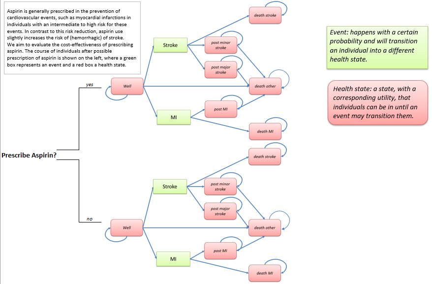

```{r setup, include = FALSE}
knitr::opts_chunk$set(echo = TRUE)
```
# Aim
This assignmment still focuses on evaluating the cost-effectiveness of aspirin treatment versus no aspirin treatment for the primary prevention of cardiovascular disease events using a health state transition model (HSTM).The aim of this practical assignment is to get improve the health state transition model (HSTM) you have built during 2A with age-dependent mortality values since we only used a mean estimate for all age in assignment 2A. Furthermore, you will include the "Aspirin" strategy to the model you have performed in the previous assignment.  During this assignment, you will first define the cohort simulations of both strategies (using (age-dependent) transition probabilities, a three-dimentional array, and matrix multiplication) and then calculate the outcomes (quality-adjusted life years, costs). First, familiarise yourself with the model structure. on the next page.  
The method described in this practical is more extensively described in @Alarid_Escudero_2020.  

# Instuctions
  
1. Download the folder `Practical_HSTM_2` from the Canvas page and save it on your computer  
2. Before performing the assignment, have a look at how the model structure looks like on the next page  
2. Open the `Assignment_2B_start.R` file and follow the instructions of this document and in the R file. Use the model structure on the next page to perform the assignment. 
3. Start the assignment by loading the inputs for the model from the `data_HSTM_2A.RData` file. The model inputs are the same as in the previous assignment.    
4. During the completion of the assignment, answer the questions of this document    
**DISCLAIMER: FOR THE FOLLOWING AASIGNMENT, ASSUME THAT PROBABILITIES ARE THE SAME. SEE @Fleurence_2007 FOR AN EXPLANATION OF THE DIFFERENCES BETWEEN RATES AND PROBABILITIES AND REMEMBER THAT WE USUALLY USE PROBABILITIES IN HEALTH ECONOMIC MODELLING**  

\newpage
# Model structure  
In this HSTM, individuals either receive aspriring or not (the two strategies we compare). These individuals may remain "Well", or they can experience a stroke or a myocardial infarction (MI). These two events may be fatal or individuals may remain in the "Post-minor stroke", "Post-major stroke", or "Post-MI" health states if they survive these events. From all health states, individuals may die from general causes of death to "Death other".  
```{r, fig.align = 'center', out.width = "90%", fig.cap = "Health state transition model structure", echo = F}

```

\newpage
# Questions
1. In the previous exercise we have used one average mortality rate for all ages. Since this is not realistic, we will now make the mortality rate age-dependent.  
1.a. Once loaded, have a look at the inputs. You can see that there is a dataframe `df_mort` added to the model inputs. This dataframe contains the probability of death of individuals for each age. Inspect this dataframe, it contains 2 columns: `Age` = age of an individual (between 20 and 115) and `p_mort` = mortality probability for each age (the data in this assignment is fake, in reality, we would use probabilities based on national statistics estimates!).  
1.b. To include these age-dependent transition probabilities in the model, we have to use 3-dimentional (3D) arrays instead of fixed transition matrices. The use of these 3D arrays allow to select a different transition matrix (containing different transition probabilities) for each cycle of the model. Arrays are defined through the `array()` function.  
1.b.i. Define empty arrays for the "No aspirin" group (called `a_tp_comp`) with `n_hs` columns, `n_hs` rows, and a depth of `n_cycles`. Inspect this array. As you can see, there are now 10 empty transition matrix when you inspect that object.    
1.b.ii. Define the start age of the cohort (`n_start_age`), which is 45 years old. 
1.b.iii. Define a vector (of 10 values) of mortality probabilities containing the transition probabilities from `n_start_age` to `n_start_age` + 9.  
1.b.iv. Fill in the array with the (time-dependent) transition probabilities, using the transition probabilities from assignment 2A, and the age-dependent mortality probability `v_p_mort` for the "No aspirin" group.    
*NOTE: elements in a array are called by the number of dimension of the array. Thus, a single element of a 3D array is called via a x, y, and z dimension. If only the x and y coordinates are provided, the vector of elements with the coordinates x and y is returned. In this case, the third dimension (the 'z') represents the cycle number while the rows and columns represent the same as in the transition matrix (transition from - to).*  
c.	


# Reference